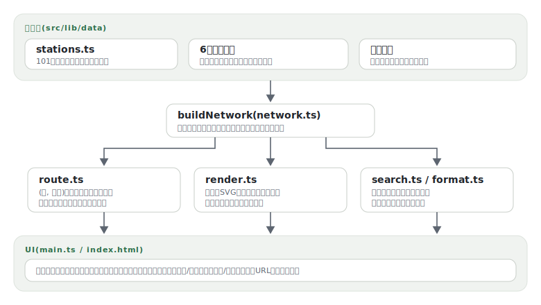

# rosen

[](https://github.com/miruky/rosen/actions/workflows/ci.yml)
[](https://github.com/miruky/rosen/actions/workflows/deploy.yml)
[](https://www.typescriptlang.org/)
[](LICENSE)

**東京主要6路線をスキーマティックなSVG路線図として描き、乗換探索ができるビューア**

デモ: https://miruky.github.io/rosen/

## 概要

rosenは、山手線・中央線快速・銀座線・丸ノ内線・日比谷線・東西線の101駅を1枚のSVG路線図として描画し、その上で出発駅から到着駅までの経路を探索するWebアプリである。座標は地理座標ではなく、駅名ラベルや他路線との重なりを避けて手で配置したスキーマティック座標で、metro map らしい読みやすさを優先している。

経路探索は(駅, 路線)の組を節点とするダイクストラ法で、同一駅での乗換時間に加えて、御徒町と上野広小路のような別名駅どうしの徒歩連絡も使って最短経路を求める。所要時間が同じ経路は乗換の少ない方を選ぶ。結果は乗車区間ごとの行程として表示され、地図上では該当区間だけが浮かび上がる。探索状態はURLハッシュに残るため、経路をリンクとして共有できる。

駅名の入力は漢字・ひらがな・カタカナのいずれでもよく、前方一致で候補が出る。地図はホイールとドラッグでパン・ズームでき、駅を続けて2つクリックしても探索が走る。配色はライト・ダーク両対応で切り替えは保存される。

### なぜ作ったのか

乗換アプリは運賃や時刻表まで抱えた大きな存在で、「路線図を眺めながら、この駅からあの駅はどう行くのが素直か」を確かめるだけの道具が意外とない。路線網をデータとして書き、図示と探索を同じデータから導けば、地図と答えが一致する小さなビューアになると考えて作った。時刻表・運賃・遅延には踏み込まず、駅間時分も日中の概算に割り切っている。

## アーキテクチャ



## 技術スタック

| カテゴリ             | 技術                                               |
| :------------------- | :------------------------------------------------- |
| 言語                 | TypeScript 5(strict、ライブラリ部は実行時依存ゼロ) |
| ビルド               | Vite 6                                             |
| テスト               | Vitest(node環境、SVGは文字列として検証)            |
| リンタ・フォーマッタ | ESLint(typescript-eslint)+ Prettier                |
| CI / 配信            | GitHub Actions / GitHub Pages                      |

## 使い方

### 路線図SVGを生成する

描画はDOMに依存しない純関数で、ネットワークからSVG文字列を組み立てる。

```ts
import { tokyoNetwork, renderMap } from './lib';

const net = tokyoNetwork();
document.getElementById('map')!.innerHTML = renderMap(net);
```

出力の各駅は `data-station="銀座"` を持つフォーカス可能な `<g>` で、`<title>` と aria-label に駅名・読み・乗り入れ路線が入る。路線は `data-line="ginza"` の `<path>` 1本ずつなので、CSSだけで任意の路線を強調できる。

### 経路を探索する

```ts
import { findRoute, summarizeRoute, describeLeg } from './lib';

const route = findRoute(net, '有楽町', '六本木');
console.log(summarizeRoute(route!)); // => 乗換1回・11分
route!.legs.map(describeLeg);
// => ['有楽町から日比谷へ徒歩連絡・4分',
//     '東京メトロ日比谷線 日比谷から六本木まで4駅・7分']
```

`findRoute` が返す行程は乗車(`ride`)・乗換(`transfer`)・徒歩連絡(`walk`)の3種で、`renderRouteOverlay` に渡すと地図に重ねるハイライトSVGになる。

### 独自の路線網を組む

データは駅レジストリ(名称・読み・図上座標)と路線定義(停車順・駅間時分)の2層に分かれており、`buildNetwork` が参照整合を検証して組み上げる。東京である必要はなく、架空の路線網でも同じAPIで描画・探索できる。

```ts
import { buildNetwork, findRoute } from './lib';

const net = buildNetwork(stations, lines, walks);
findRoute(net, '甲', '丙');
```

## プロジェクト構成

- `src/lib/data/` 駅レジストリと6路線・徒歩連絡の定義
- `src/lib/network.ts` 検証つきネットワーク構築
- `src/lib/route.ts` ダイクストラ法による乗換探索
- `src/lib/render.ts` 路線図・経路ハイライトのSVG生成
- `src/lib/search.ts` 読み対応の駅名検索
- `src/lib/format.ts` 行程の日本語表記
- `src/main.ts` フォーム・パン/ズーム・テーマなどのUI配線
- `docs/` アーキテクチャ図

## はじめ方

### 前提条件

- Node.js 22以上

### セットアップ

```bash
git clone https://github.com/miruky/rosen.git
cd rosen
npm ci
npm run dev
```

### テスト・lint・ビルド

```bash
npm test
npm run lint
npm run build
```

### デプロイ

mainへのpushで `deploy.yml` がGitHub Pagesへ公開する。サブパス配信のためのbaseは環境変数 `ROSEN_BASE` で渡す。

## 設計方針

- **図示と探索を同じデータから導く** — 路線定義は描画(座標・色)と探索(駅間時分・接続)の両方の源で、地図と答えが食い違わない。
- **座標の品質をテストで縛る** — 手置きのスキーマティック座標は壊れやすいため、駅どうし・駅と他路線の最小間隔をテストで検査し、編集による図の破綻を防ぐ。
- **(駅, 路線)を節点にする** — 駅単位のグラフでは乗換回数を費用に乗せられない。節点を路線ごとに分けることで、乗換時間と「同時間なら乗換が少ない方」を自然に表現する。
- **ライブラリ部はDOM非依存** — SVGは文字列として組み立て、探索・描画・検索のすべてをnode環境のVitestで直接テストする。
- **割り切りを明示する** — 収録は6路線101駅、時分は概算で、時刻表・運賃・遅延情報は扱わない。

## ライセンス

[MIT](LICENSE)
